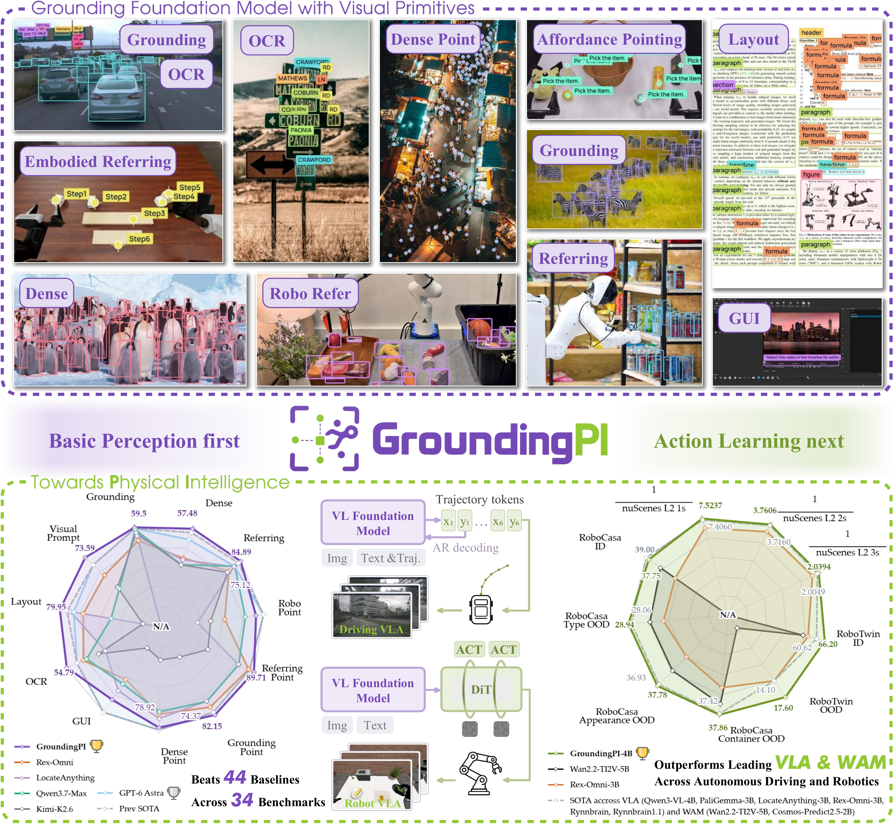

<h1 align="center"></h1>

<p align="center">English | <a href="README.zh-CN.md">简体中文</a></p>

<p align="center"><strong>A Grounding Foundation Model towards Physical Intelligence with Visual Primitives</strong></p>

<p align="center">
  [<a href="https://arxiv.org/abs/2609.39601">📘 Paper</a>]
  [<a href="https://huggingface.co/GroundingPI/GroundingPI">🤗 HF Model</a>]
  [<a href="https://huggingface.co/spaces/GroundingPI/GroundingPI">🤗 HF Demo</a>]
  [<a href="https://groundingpi.github.io/">🌐 Project Page</a>]
  [<a href="https://github.com/groundingpi/GroundingPI">💻 GitHub</a>]
</p>

<p align="center"><a href="#demo">Demo Video</a> · <a href="#quick-start">Quick Start</a> · <a href="#documentation">Documentation</a> · <a href="#citation">Citation</a></p>

> **GroundingPI** is a grounding foundation model that turns images and language into precise boxes and points, connecting visual grounding with physical intelligence.

<p align="center"></p>

<a id="news"></a>

## 📰 News

- **2026-10-03:** Released the source code, inference guides, and full-suite evaluation workflows.
- **2026-10-01:** We released the [GroundingPI model weights](https://huggingface.co/GroundingPI/GroundingPI) on Hugging Face.
- **2026-09-30:** The [GroundingPI paper](https://arxiv.org/abs/2609.39601) is available on arXiv.

<a id="contents"></a>

## 🧭 Contents

[Highlights](#highlights) · [Demo](#demo) · [Models](#models) · [Installation](#installation) · [Quick Start](#quick-start) · [vLLM Deployment](#vllm-deployment) · [Tasks and Output Format](#tasks-and-output-format) · [Method and Inference Infrastructure](#method-and-inference-infrastructure) · [Evaluation](#evaluation) · [Training](#training) · [Physical Intelligence](#physical-intelligence) · [Results](#results) · [Documentation](#documentation) · [License](#license) · [Citation](#citation) · [Acknowledgement](#acknowledgement)

<a id="highlights"></a>

## ✨ Highlights

- **A strong grounding foundation model.** We introduce GroundingPI, a 4B model built on visual primitives that unifies diverse perception tasks through points, boxes, and a shared coordinate vocabulary. A staged training recipe delivers state-of-the-art grounding performance across 34 benchmarks.
- **Transfer toward physical intelligence.** Autonomous-driving and robotic-manipulation evaluations demonstrate strong in-distribution and out-of-distribution transfer, together with improved action-data efficiency.
- **Insights into perceptual pretraining and embodied model design.** We analyze how pretraining scale and data composition affect grounding and downstream transfer, highlighting dense grounding and OCR and discussing implications for System-1 foundations that complement high-level reasoning and planning.

<a id="demo"></a>

## 🎬 Demo

<p align="center"><a href="https://huggingface.co/GroundingPI/GroundingPI/resolve/aca9bde34a146cf0510e7f8732d4766169105194/assets/demo.mp4"></a></p>

[▶ Watch the demo](https://huggingface.co/GroundingPI/GroundingPI/resolve/aca9bde34a146cf0510e7f8732d4766169105194/assets/demo.mp4)

<a id="models"></a>

## 🤗 Models

| Checkpoint | Generation | Download | Evaluation mode |
|:---|:---|:---|:---|
| GroundingPI | Autoregressive visual grounding | [Hugging Face](https://huggingface.co/GroundingPI/GroundingPI) | **GAM** |

The grounding checkpoint contains the vision-language model, tokenizer, processor, and custom model code. Downstream action-policy integrations are described in [Physical Intelligence](#physical-intelligence).

<a id="installation"></a>

## 🛠️ Installation

The serving workflows below target **Linux x86_64 and Python 3.12**. Start from a compatible accelerator runtime with **Torch and vLLM 0.18.x already installed**. The serving setup inherits that runtime and installs the bundled **Transformers 5.7.0** fork.

```bash
git clone https://github.com/groundingpi/GroundingPI.git
cd GroundingPI
python3 -m pip install -r requirements.txt huggingface_hub
```

Already have a source checkout? Start with `cd GroundingPI`. Run subsequent commands from the repository root.

`requirements.txt` installs the lightweight HTTP client, visualization tools, and setup dependencies. Serving, training, and evaluation each use their own environment; `pip install -r requirements.txt` alone does not install the model runtime. The client does not load weights and requires no Torch installation.

**Tested accelerators:** NVIDIA **B300, B200, H200, H800**, and **PPU**. Use the matching runtime for each accelerator. See [Environment Setup](environments/README.md) for installation details.

<a id="quick-start"></a>

## 🚀 Quick Start

<a id="download-the-model-and-start-the-service"></a>

### 📥 Download the model and start the service

```bash
hf download GroundingPI/GroundingPI --local-dir weights/vlm

# In a compatible NVIDIA GPU runtime with vLLM 0.18.x available:
python3 run.py setup serve
python3 run.py serve
```

For **PPU**, replace the setup command with `python3 run.py setup serve --platform ppu` inside the matching vendor runtime image, then run `python3 run.py serve`. The installer records the platform, and the launcher selects the corresponding configuration.

| Service | Base URL | Model ID |
|:---|:---|:---|
| GroundingPI | `http://127.0.0.1:8000/v1` | `groundingpi` |

Download the complete model package. The vLLM adapter uses a separate overlay and reuses the original weight shards; use a new overlay output directory when switching checkpoints, as described in the [Inference Guide](docs/INFERENCE.md).

<a id="run-a-prediction"></a>

### 🎯 Run a prediction

Keep the service running. In a second terminal, use the environment where you installed `requirements.txt` and replace `your_image.jpg` with your image:

```python
from grounding_pi import GroundingPi, visualize

client = GroundingPi(
    base_url="http://127.0.0.1:8000/v1",
    model="groundingpi",
)

# Referring-expression grounding
result = client.predict("your_image.jpg", "the red car", task="bbox")
print(result.to_dict())
if result.valid:
    visualize("your_image.jpg", result).save("prediction.png")

# Point localization
point = client.predict(
    "your_image.jpg", "the center of the red car", task="point"
)
print(point.to_dict())
```

The command-line example saves `result.json` and, for valid output, `prediction.png`. Choose a new output directory for each run:

```bash
python3 examples/predict.py \
  --image your_image.jpg --phrase "the red car" \
  --task bbox --output outputs/car
```

<details>
<summary>Client parameters and return values</summary>

| Interface | Parameters |
|:---|:---|
| `GroundingPi(...)` | `base_url`, `model`, optional `api_key`, `timeout` (default: 120 seconds) |
| `predict(...)` | Image path (JPEG, PNG, WebP), referring phrase, `task="bbox"` or `"point"`, `max_tokens` (default: 4096) |
| `visualize(...)` | Image path and a valid result; returns a Pillow image |

`result.to_dict()` contains `task`, `predictions`, `raw_output`, `finish_reason`, `usage`, `parse_error`, and `valid`. Parsed predictions contain labels and coordinates on a **0–999** grid. The visualizer converts them to image pixels. Truncated or malformed responses have `valid=False` and retain their raw output for inspection.

</details>

See [Examples](examples/README.md) and the [client implementation](grounding_pi/client.py) for more usage details.

<a id="vllm-deployment"></a>

## ⚡ vLLM Deployment

The default GroundingPI service uses **vLLM's Transformers backend** with the repository's model and processor adapter. Start from **Linux x86_64 / Python 3.12** with accelerator-compatible **Torch and vLLM 0.18.x** already installed. The setup inherits that runtime and installs the bundled **Transformers 5.7.0 fork**.

For **NVIDIA GPUs**, run from the repository root:

```bash
hf download GroundingPI/GroundingPI --local-dir weights/vlm
python3 run.py setup serve --platform gpu
python3 run.py serve --config configs/release/vlm_vllm_gpu.yaml
```

For **PPU**, use the matching vendor image and PPU build of vLLM, then replace the two commands after download with:

```bash
python3 run.py setup serve --platform ppu
python3 run.py serve --config configs/release/vlm_vllm_ppu.yaml
```

If the serving environment is already prepared, skip setup. Setup requires a new environment directory; use the same `--venv` on setup and serving when choosing a different directory. Once the server is ready, check its model list in another terminal:

```bash
curl --fail http://127.0.0.1:8000/v1/models
```

The endpoint is **`http://127.0.0.1:8000/v1`**, with model ID **`groundingpi`**. Defaults are **BF16, eager execution, TP=1, one active sequence, 16,384 context tokens, and 0.7 accelerator-memory utilization**. Each request accepts one image; video is disabled. The adapter reuses the checkpoint's weights through a separate serving overlay.

For custom `/chat/completions` requests, set **`skip_special_tokens: false`** and **`spaces_between_special_tokens: false`** to preserve GAM's adjacent coordinate tokens. Use **GAM** evaluation mode. See the [vLLM Deployment Guide](docs/VLLM.md) for a complete single-image API example, configuration overrides, and runtime checks.

<a id="tasks-and-output-format"></a>

## 🎯 Tasks and Output Format

The models accept one image and a text instruction. The convenience client's `predict()` method constructs referring-box and referring-point prompts. For other tasks, send the corresponding prompt to the service's OpenAI-compatible `/v1/chat/completions` endpoint.

| Task | Prompt |
|:---|:---|
| Object / dense grounding | `Locate all the instances that match the following categories: car</c>person.` |
| Referring boxes | `Locate the target referred to by the following description: the red car.` |
| Object points | `Point to: car</c>person.` |
| Referring points | `Point to the target referred to by the following description: the red car.` |
| OCR | `OCR task detect all the text in box format.` |
| Document layout | `Detect all document layout elements that match the following categories: title</c>text.` |
| GUI grounding | `Point to the UI element to click for the following instruction: open the settings menu.` |
| Visual prompting | Provide reference boxes in the native spatial-token format, then request similar objects. |

<details>
<summary>Visual-prompt example</summary>

```text
Given reference boxes <|box_start|><100><200><500><650><|box_end|> indicating one or more objects, find all similar objects in the image and output their bounding boxes.
```

</details>

All released checkpoints use the **GAM spatial-token protocol**, with integer coordinates from **0 to 999**. Boxes contain `(x1, y1, x2, y2)`; points contain `(x, y)`. A missing target is represented by `None`.

```text
<|object_ref_start|>car<|object_ref_end|><|box_start|><100><200><500><650><|box_end|>
<|object_ref_start|>car center<|object_ref_end|><|box_start|><300><425><|box_end|>
<|object_ref_start|>absent object<|object_ref_end|><|box_start|>None<|box_end|>
```

Use the checkpoint's tokenizer, processor, and chat template. Custom HTTP requests should keep `skip_special_tokens=false`, preserve adjacent coordinate tokens without added spaces, and send the image as a base64 data URI in an `image_url` content part alongside the text prompt.

<a id="method-and-inference-infrastructure"></a>

## ⚙️ Method and Inference Infrastructure

GroundingPI combines a **MoonViT-V2 / Kimi-K3 vision backbone**, a **2 × 2 spatial aggregation projector**, and a **Qwen3-4B-Instruct-2507** language backbone. It generates semantic labels, protocol markers, and 1,000 coordinate tokens autoregressively.

<p align="center"></p>


The default service uses **vLLM**, **BF16**, one image per request, a **16,384-token context limit**, and tensor parallel size **1**. The custom adapter preserves the model's native spatial-token interface while vLLM manages execution and KV caching.

The supplied launcher uses **eager execution**; **CUDA Graph is disabled** in this recipe. A native Transformers reference service is also available. See [Inference](docs/INFERENCE.md) for custom configurations and reference-backend usage.

<a id="evaluation"></a>

## 📈 Evaluation

The GroundingPI evaluation suite covers the **34 benchmarks** reported in the paper. The [Evaluation Guide](eval/README.md) provides the data link, path setup, the exact 34-task selection, input validation, and full-suite execution.

The shared evaluator supports **7 modes**:

| Mode | Supported models |
|:---|:---|
| **`GAM`** | **GroundingPI, GroundAnything, GroundAnything-VLM** |
| `VLM` | Generic vision-language baselines |
| `REXOMNI` | Rex-Omni |
| `LOCATEANYTHING` | LocateAnything |
| `GROUNDINGDINO` | GroundingDINO through a compatible service |
| `DLM` | Legacy diffusion checkpoints using the GAM protocol |
| `RLV2` | Legacy RL checkpoints using the GAM protocol |

**Use GAM mode for all three released checkpoints.** Start the model service and configure the data paths before running:

```bash
python3 run.py setup eval
python3 run.py eval --config configs/eval/gam.yaml
```

The shipped recipes are **8-sample smoke tests** for selected tasks. For the complete 34-benchmark suite, follow the [full evaluation walkthrough](eval/README.md#full-suite): it selects the paper's task list, uses `limit: null`, and writes results under a fresh `run_id`. Evaluation connects to an existing service and does not start or switch its decoder.

<a id="training"></a>

## 🏋️ Training

Training runs in its own environment. Prepare the complete model files, tokenizer, validated input caches, and manifests before launching. The supplied training environment targets the matching **PPU vendor image**. See [Environment Setup](environments/README.md) for the matching runtime and dependencies.

<a id="configure-supervised-fine-tuning"></a>

### 🛠️ Configure supervised fine-tuning

| Configuration | What to set |
|:---|:---|
| [`configs/train/vlm.yaml`](configs/train/vlm.yaml) | Model and tokenizer-manifest paths, prepared input caches, learning rates, batch size, sequence length, and output directory |
| [`configs/release/vlm_train.yaml`](configs/release/vlm_train.yaml) | Native configuration path, environment, and distributed launch settings |

The native recipe supports separate learning rates for the language model, vision encoder, and projector. Set their freeze flags to select which components to train. Keep `runtime.expected_nodes`, `expected_gpus_per_node`, and `expected_world_size` consistent with the launch topology. The effective global batch size is the per-device batch size multiplied by world size and gradient accumulation steps.

```bash
python3 run.py setup train

# Inspect the configured training command before launching.
.venv-train/bin/python scripts/run.py configs/release/vlm_train.yaml --dry-run

python3 run.py train --config configs/release/vlm_train.yaml
```

The default recipe uses BF16 and writes checkpoints to `outputs/vlm_train/`. Input caches must match the model tokenizer and carry the required manifests. See [Data Preparation](docs/DATA_PREPARATION.md); the repository does not provide a generic JSONL-to-training-cache converter.

<a id="resume-training"></a>

### 🔄 Resume training

Point `checkpoint.resume_from_checkpoint` in the launch YAML, or `training.resume_from_checkpoint` in the native YAML, to a complete training checkpoint. Configure it in one place and rerun the same launch command. A checkpoint with optimizer, scheduler, and training state is required to continue an interrupted run.

See [Training](docs/TRAINING.md) for the detailed configuration and checkpoint workflow.

<a id="physical-intelligence"></a>

## 🤖 Physical Intelligence

The [`vla/`](vla/README.md) directory contains companion backbone-comparison workflows built on StarVLA and OpenWAM, with separate policy-training and evaluation configurations:

| Integration | Entry point |
|:---|:---|
| Action-model backbone comparison | [starVLA integration](vla/starvla/README.md) |
| Action-model backbone comparison | [OpenWAM integration](vla/openwam/README.md) |

The Hugging Face release is a grounding vision-language model. The supplied comparison recipes use the backbones listed in the [VLA Guide](vla/README.md) and require their own environments and policy checkpoints; they do not provide a direct action-policy adapter for the released GroundingPI checkpoint.

<p align="center"></p>


<a id="results"></a>

## 📊 Results

<p align="center"></p>


Full benchmark definitions, comparisons, and downstream experiments are in the [paper and supplementary material](https://arxiv.org/abs/2609.39601).

<a id="documentation"></a>

## 📚 Documentation

| Guide | Contents |
|:---|:---|
| [Environment Setup](environments/README.md) | Workflow environments and platform prerequisites |
| [Inference](docs/INFERENCE.md) | Serving, model preparation, configuration, and reference backend |
| [Examples](examples/README.md) | Image prediction, JSON output, and visualization |
| [Evaluation](eval/README.md) | Dataset setup, paper benchmark suite, execution, and results |
| [Training](docs/TRAINING.md) | Training recipes, distributed settings, and checkpoints |
| [Data Preparation](docs/DATA_PREPARATION.md) | Input formats and local preparation requirements |
| [Third-party Sources](third_party/README.md) | Bundled frameworks and provenance |

```text
GroundingPI/
├── run.py                  # Workflow launcher
├── grounding_pi/             # Lightweight HTTP client and visualization
├── configs/                # Serving, training, and evaluation recipes
├── infer/                  # Model services
├── train/                  # Training workflows
├── eval/                   # Tasks, prompts, requests, and metrics
├── models/                 # Model definitions
├── examples/               # Prediction examples
├── environments/           # Environment installers
└── docs/                   # Detailed guides
```

Use `python3 run.py --help` to inspect the command-line interface. Full model workflows run from the source tree; the Python package installs the independent HTTP client.

<a id="license"></a>

## 📜 License

Original project contributions are available under the [Apache License 2.0](https://www.apache.org/licenses/LICENSE-2.0), with no additional restrictions imposed by this project. This grant covers only rights held by the contributing authors.

Third-party material retains its applicable licenses, including the [Kimi K3 License](models/vlm/LICENSE) for Kimi-derived material and applicable derivative works. These upstream conditions remain in force. See [Third-party Notices](THIRD_PARTY_NOTICES.md) for component attribution and the [released model's license scope](https://huggingface.co/GroundingPI/GroundingPI/blob/main/LICENSE) for the model package.

The physical-intelligence integrations retain the terms in [`vla/LICENSE`](vla/LICENSE) and their [third-party notices](vla/THIRD_PARTY_NOTICES.md).

<a id="citation"></a>

## 📖 Citation

If this work supports your research, please cite:

```bibtex
@misc{yu2026groundingpigroundingfoundationmodel,
  title = {{GroundingPI}: A Grounding Foundation Model towards Physical Intelligence with Visual Primitives},
  author = {Qize Yu and Lianrui Fan and Boyu Chen and Jiaqi Liang and Xini Ding and Yue Chen and Zetian Song and Yuran Wang and Yi Zou and Kaixuan Wang and Tianxing Chen and Wenxuan Song and Bohan Zhou and Mingleyang Li and Siqiao Huang and Yuqi Ye and Caigao Jiang and Wei Wei and Ruihai Wu and Hang Zhang and Yixiao Ge and Shuchang Zhou and Shilong Liu and Xianming Liu and Ping Luo and Shiyu Huang},
  year = {2026},
  eprint = {2609.39601},
  archivePrefix = {arXiv},
  primaryClass = {cs.CV},
  url = {https://arxiv.org/abs/2609.39601},
}
```

<a id="acknowledgement"></a>

## 🙏 Acknowledgement

We thank the teams behind [Rex-Omni](https://github.com/IDEA-Research/Rex-Omni) and [LocateAnything](https://github.com/NVlabs/Eagle/blob/main/Embodied/README.md) for sharing their work and open-source implementations.
